# a parametric, veneer covered wooden LED matrix

includes casing for custom PCB based on ESP32 featuring LED driver, PIR and ambient light sensors, and touch buttons.
it can be wall mounted or just put on a flat surface.

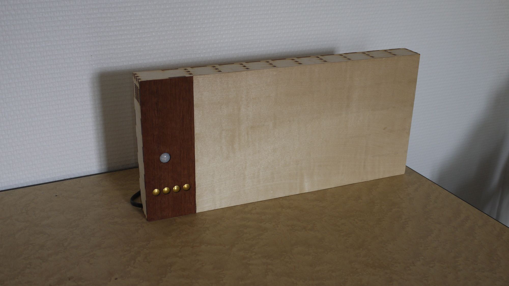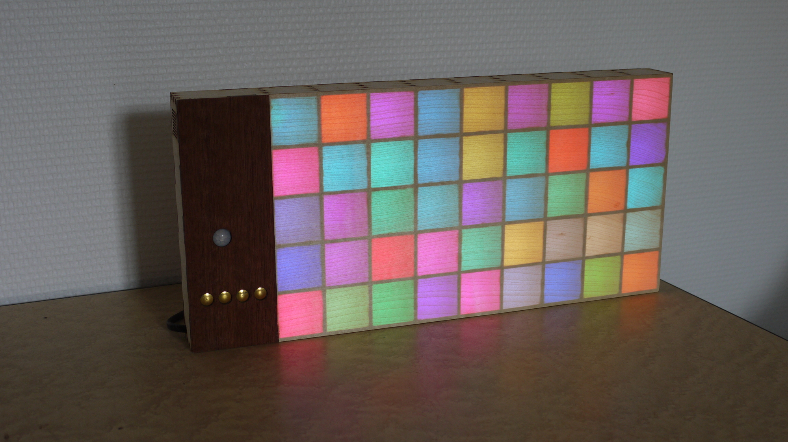

inspired by: [maketvee's Wooden LED Gaming Display](https://www.instructables.com/Wooden-LED-Gaming-Display-Powered-by-Raspberry-Pi-/)
assisted by scripts from: [scottbez1's split-flap](https://github.com/scottbez1/splitflap/)

intended for weather forecast display but can be used for anything fitting the small resolution.

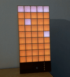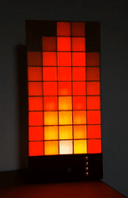

## **usage**
set parameters at the beginning of **board.scad** according to your needs. many parameters are available, including matrix resolution, wood thickness, kerf, ...
run **scripts/generate_2d.py** to generate SVG files for laser etching/engraving/marking/cutting.
you can adjust the kerf to fit your laser and other parameters with the script arguments.
the script render the 2d view of board.scad file and optimize the laser cutting by removing redundant lines.

## **recommended parameters**
the main dimension driver is the LED strip interval, which correspond to pixel height and width.
designed for 30 LED/m strip (33.3mm interval), it should be possible to use 60 or 15 LED/m strips however LED brightness might be insufficient for the later, depending on the veneer's light transmission.
however any pixel dimension is possible with other strip interval or by using standalone LEDs.
adjust the LED interval in led_ADA1376_dimensions.scad file accordingly.

## **design**
the parts placement is optimized to fit 2 A3 plywood sheets for a 9x5 pixels matrix.
if you change this resolution you might need to modify the last part of the board.scad script to fit your own resolution vs sheet dimensions.

### veneer
I used sycomore 0.3mm veneer - 0.6mm should allow enough light transmission.
choose whitest available wood veneer to limit color drift (can be compensated on software).

### touch buttons
intended to be hidden behind veneer, however extension veneer (0.6mm thick) doesn't allow reliable touch detection. 0.3mm veneer might work with carefull tuning of detection values to prevent false positive or undetected touches. I found it was easier to just cut the veneer and make buttons visible, while visually acceptable with their brass tacks shining.

### laser
adjust your laser parameters for each color/mode:
black: etch
orange: engrave (~1mm)
blue: mark
red: cut

## **assembly**
cut LED strip to length and lay on the back panel according to marking, taking care of data direction, **starting from top left**.
solder power and data cables: each strip is directly connected to power source, data follow a zig-zag way from top left.

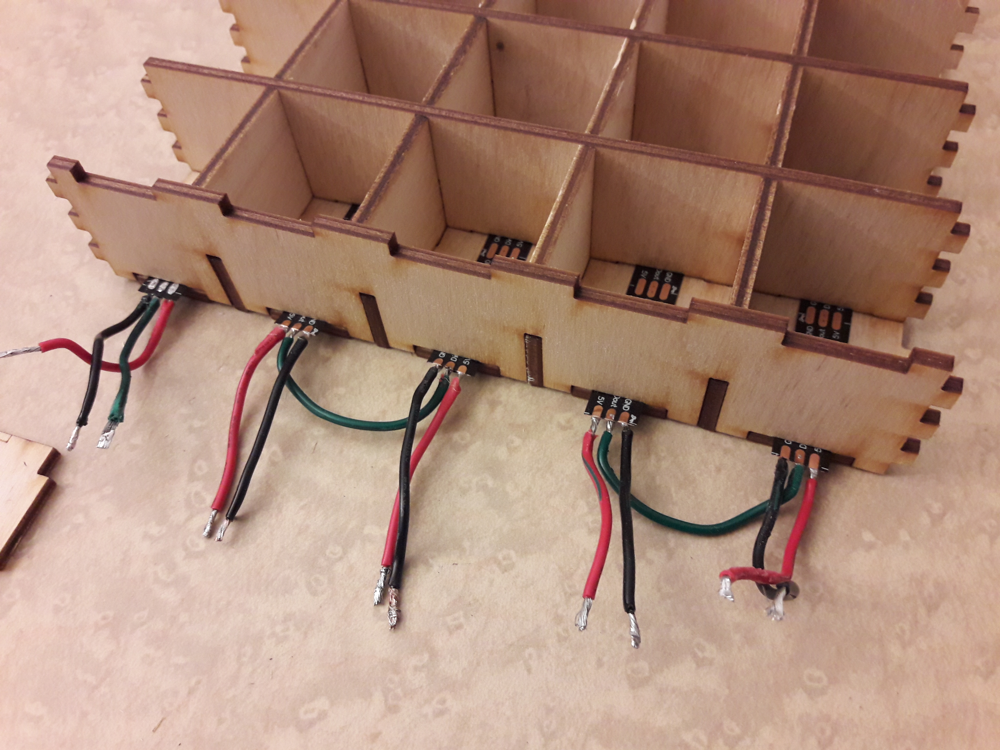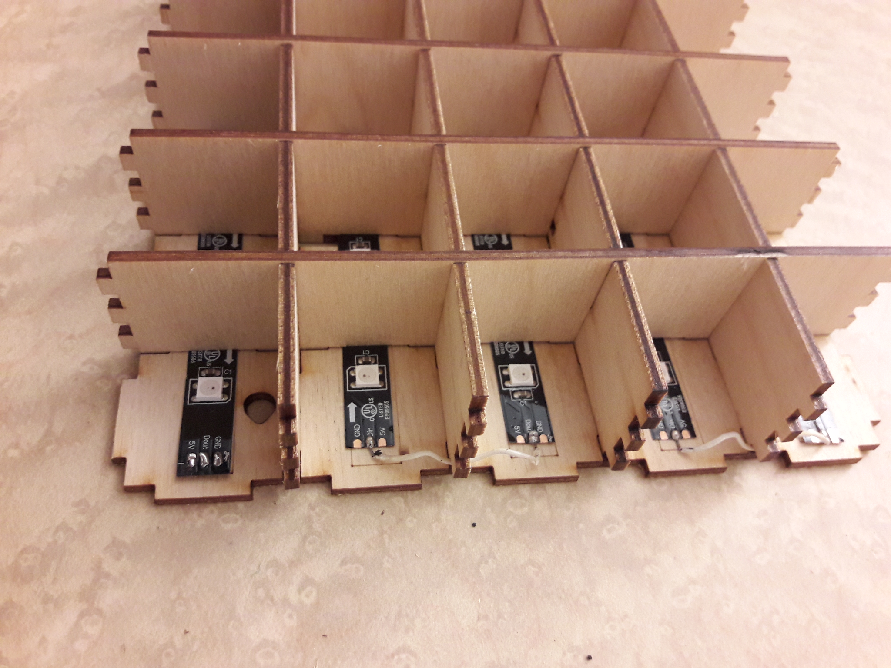

assemble the horizontal spacers first then vertical spacers

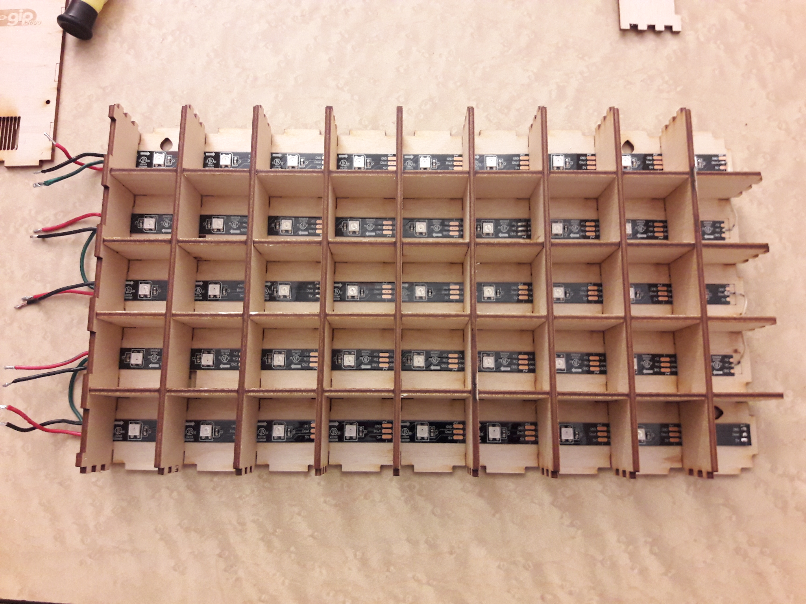

then add the border panels, and the extension front panel (supporting the PCB).

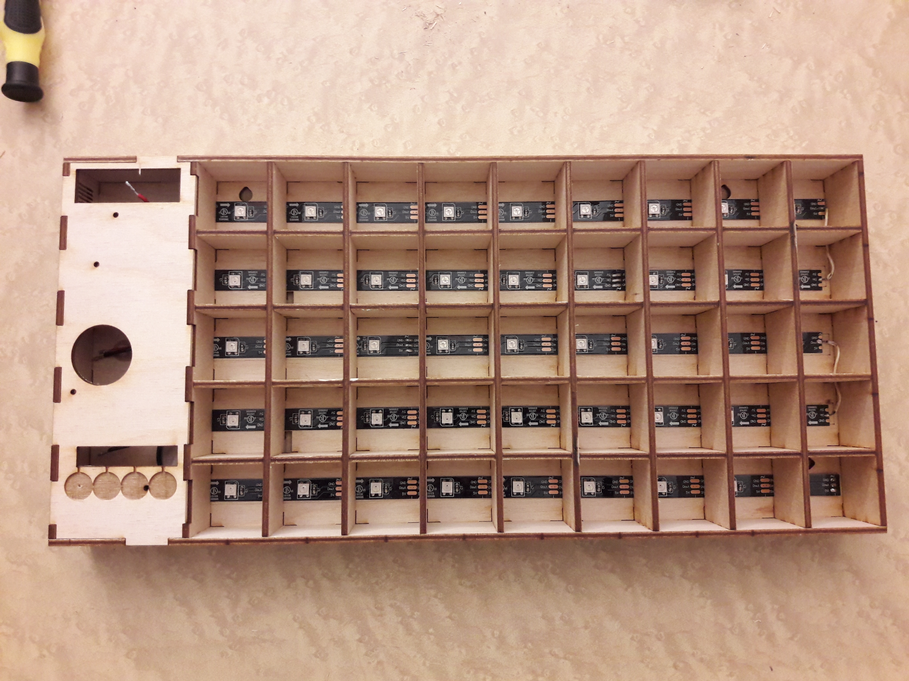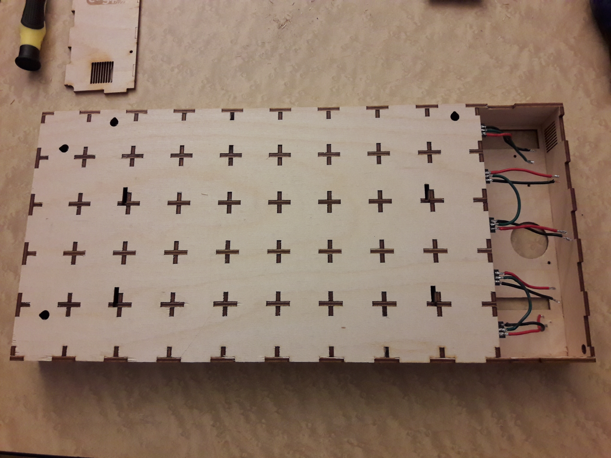
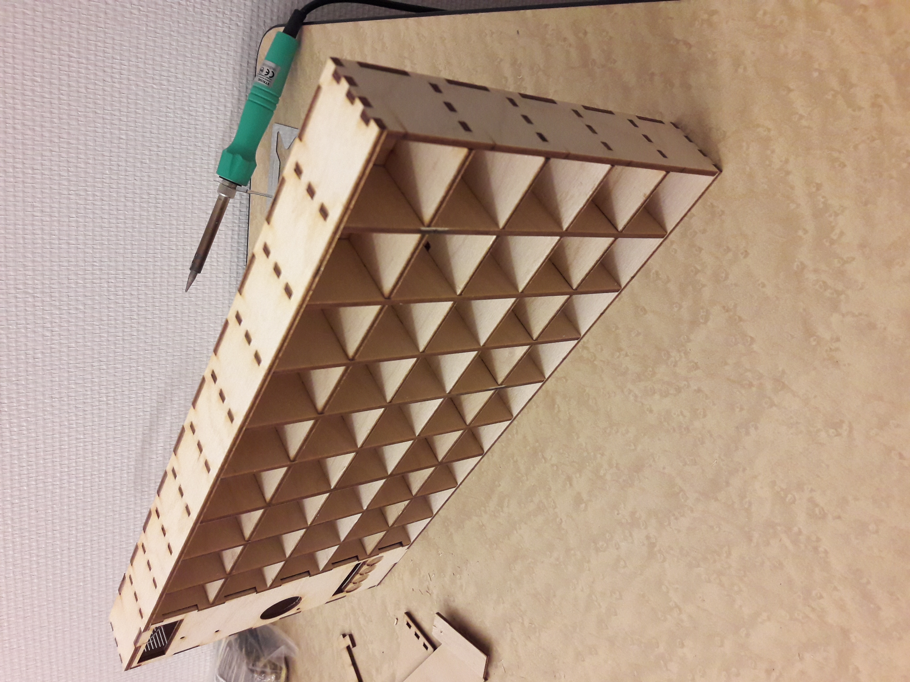

place and connect the PCB, touch buttons (made from tacks with attached cables connected to GPIOs).

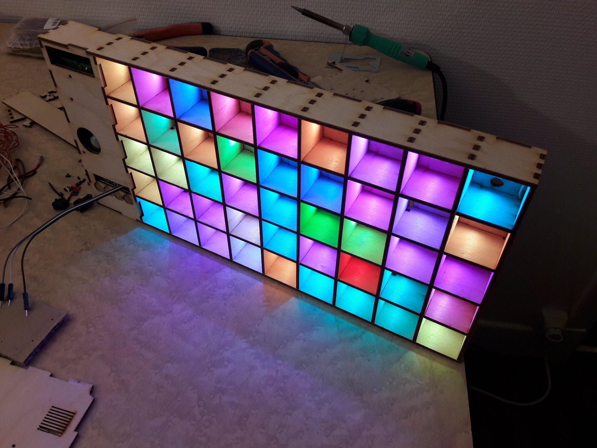

eventually glue the wood veneer. I chose to use different woods for extension and LED matrix but you can use the same veneer (parameterized on the board.scad file).

