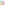
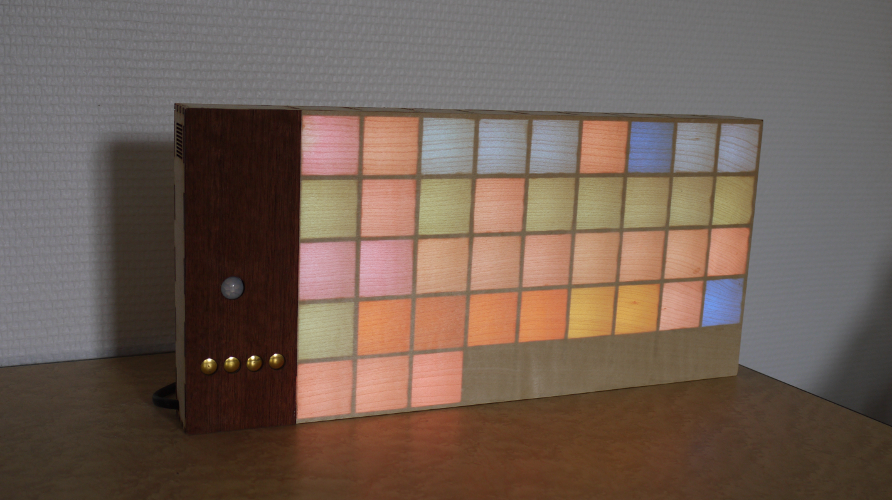
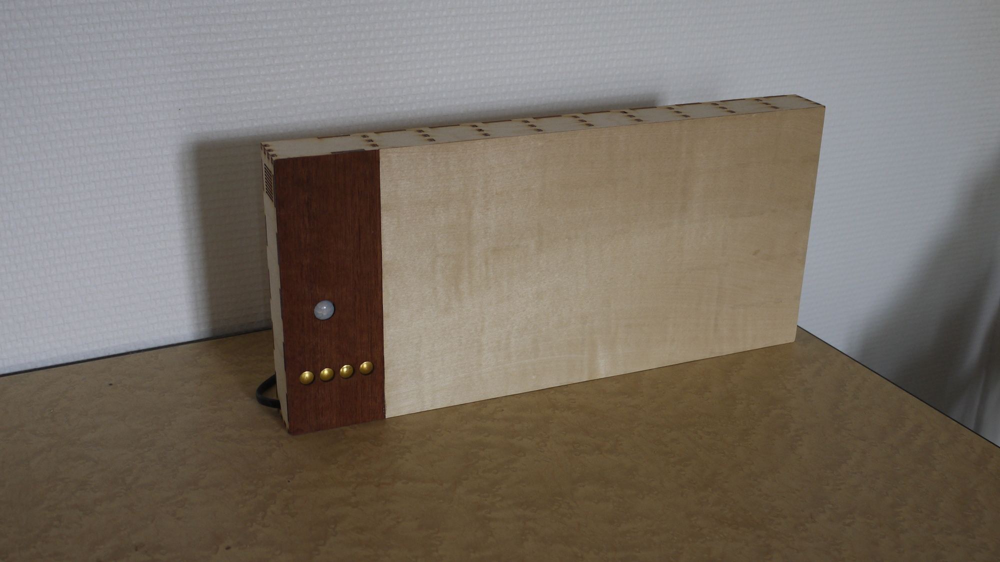
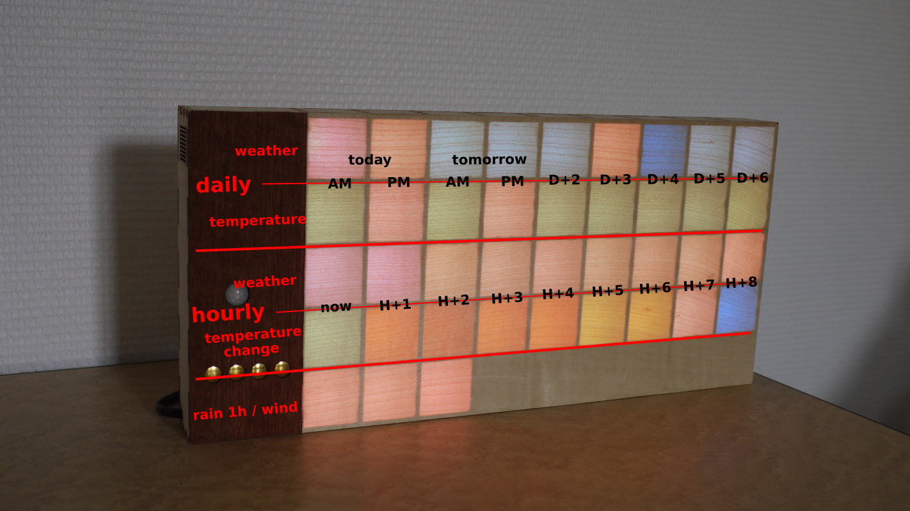
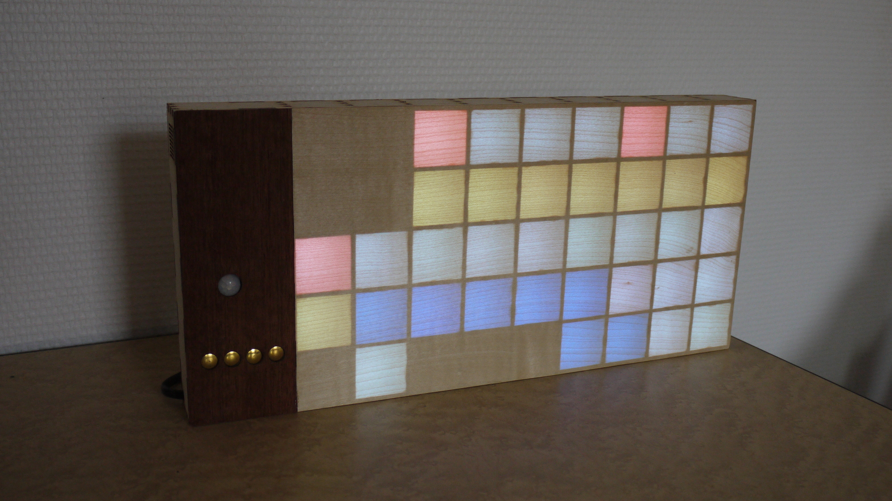
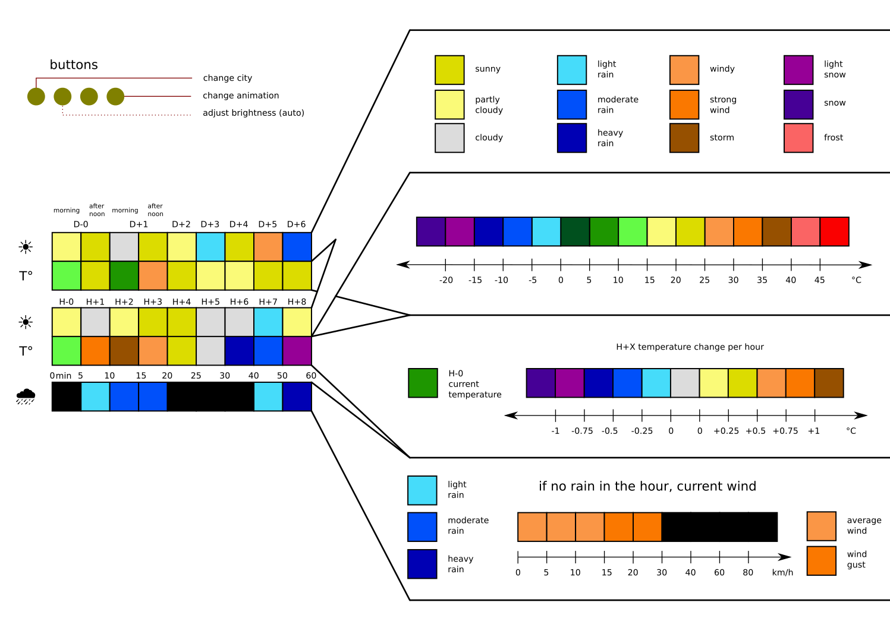

# meteoboard - colorful weather forecast visualization 

meteoboard is a LED matrix displaying weather forecast with color mapping to weather condition or temperature values. for example sunny weather is obviously yellow and rain condition is represented with 3 shades of blue. see the user guide for detailed color/value mapping.
with a bit of practice it allows an instant knowledge of weather forecast, on a decorative object.

<figure>
    
    <figcaption>user guide</figcaption>
</figure>
<figure>
    
    <figcaption>rain is coming</figcaption>
</figure>

the LED matrix can also be used to display various animations.

inspired by [maketvee's Wooden LED Gaming Display](https://www.instructables.com/Wooden-LED-Gaming-Display-Powered-by-Raspberry-Pi-/)

## features
- daily, hourly weather and temperature forecast + rain in the hour / current wind
- 4 touch buttons to control the display (change city, animation, ...)
- PIR and ambient light sensors to switch on only when necessary, at the right brightness

## usage

## hardware

### case
[parametric wooden LED matrix](3d/)

### PCB
designed with KiCad
based on ESP32 it includes the sensors and allows to easily connect the LED strips.

## software
needs cleanup before releasing...

